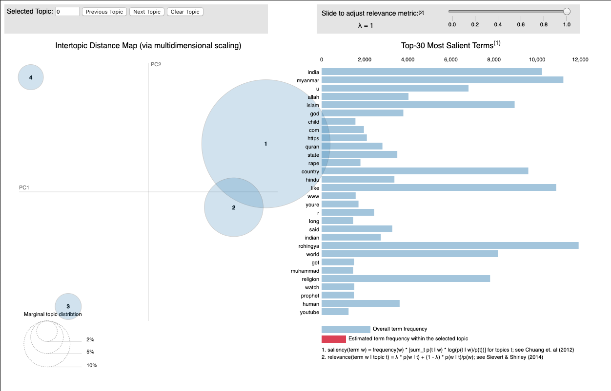

# Social Media Topic Modeling Toolkit

This tool can be used to obtain a summarization of an inputted social media comments corpus -- it characterizes a corpus as a mixture of topics. The topics themselves are an admixture of word distributions.

In methodology, the tool lets you train and use latent Dirichlet allocation (LDA). The outputs are a file with the topics/proportions and a web-viewable visualization.

## Table of Contents

* [Background](#background)
* [Dependencies](#dependencies)
* [Execution](#execution)
* [Examples](#examples)

### Background

Comments in social media are a rich set of data for data scientists to mine to understand perspectives, but the data can be overwhelming. Human categorization is difficult if not impossible at scale. We developed and tested a method for identifying representative comments from semantic clusters of comments. This uses document embedding for topic modeling. The technique uses a simple document embedding algorithm, and allows for a variety of downstream applications.

Recent work has explored the use of natural language models to discover topics from large corpora [1]. The approach in [1] uses a simple document embedding baseline from [2] and clusters these embeddings using cosine distance as the metric. The resulting clusters are shown to correspond to coherent topics and intrusion tests demonstrate that the resulting topic clusters are of a high quality.

We started with the document embedding technique from [3], and clustered a set of 10,000 sample documents using cosine distance as the metric. At the end of this step, our document sample is clustered into K clusters (typically K=6 - 10). We could compute the topic-word distribution trivially, using the documents in each of these clusters.

In addition, we could retrieve salient representative comments for each of the topic clusters by picking the documents closest to their assigned topic clusters (using cosine similarity as the proximity metric).

Our dataset, in particular, was a collection of English language YouTube comments on videos discussing the Rohingya refugee crisis. The discovered topics are comparable to or better than those discovered by traditional techniques like LDA. We choose K=4 (i.e. 4 topics) based on visual inspection of the clusters and report below the representative comments discovered. We report 3 topics because the fourth cluster was found to be incoherent. The top tokens for each topic clusters are obtained using the metric from [4].


| Topic | Top 5 tokens | Label |
|-------|--------------|-------|
| 1 | india, country, muslims, people, bangladesh | Geopolitical discussion Indian subcontinent |
| 2 | rohingya, myanmar, people, muslims, burmese | Discussion of the rohingya crisis centered in Burma |
| 3 | muslims, islam, religion, world, allah | Comments about Islam |


| Topic | Representative comment |
|-------|------------------------|
| 1 | rohingyas are illegallly entered people see them with that poverty terrorism among poor muslims go hand in hand when they dont love there residing nation eu is better example with daily terror attacks rohingyas are fighting for islamic state in myanmar register everyone taking biometrics and send every last one to myanmar and verify them after they reach myanmar or to some islamic nation they went india has enough poor people dont add burdern and national security risk taking these people and putting in sensitive locations there are hundreds of fraud committed by these tiny group of people taking illegal aadhar and passports already in hyderabad itself all over india they have caused this fraud identity theft caused bombings in bodh gaya and harassing buddhists in india ever heard a buddhist travelling with fraudly morphed indian passport see them as illegals period send them back to any nation they want or back to myanmar or eu nations which kept our corrupt frauds who say india is politically motivated to arrest them and escape making banks loose money , we cant compromise on security we have piles of our own internal issues dont allow rohingyas to refuge we can give sympathy we can deal with mynamar over this issue but we cant provide shelter |
| 2 | un has utterly failed in addressing the issue and its a plethora of reasons from historic to ethnic political and economic that have caused the crisis humanitys worst crisis even in th era of technology, cover why the bhuddists are attacking them the war between the two is nothing new its just the bhuddists have the upperhand also myanmar is sandwiched between two islamic asian countrys theyre simply protecting their way of life |
| 3 | hdsharp i said to u troll because u are racist to muslim people u sport one side use ur mind n find how the west is playing dirty game with the muslim people, jake byron no it isnt its factually correct its exactly what islam teaches muslims aim to make the entire world muslim |

### Dependencies

You can install all dependencies using:

```
pip install -r requirements.txt
```

### Execution

1. Construct a corpus from a text file.:

```
python corpus.py /path/to/posts.txt /path/to/save/dictionary.dict
```

In the command above `/path/to/posts.txt` is a collection of documents - with one document per line. 
The resulting `/path/to/save/dictionary.dict` is generated.

2. Run Gensim LDA on the corpus:

```
python topics.py /path/to/corpus.txt /path/to/dictionary.dict <prefix> <n_topics> <n_passes> <log_prefix>
```

This dumps a standalone HTML file with a [pyLDAVis](https://github.com/bmabey/pyLDAvis) visualization.
The trained LDA model is saved at `<prefix>`. `<n_topics>` is typically chosen by trial-and-error, and
in our experience 50, 100 are good values for `<n_passes>`.

3. Extract visualizations:

```
python lda_visualizer.py /path/to/lda/model /path/to/text/corpus /path/to/dictionary /path/to/destination
```

This dumps a standalone HTML file with a pyLDAVis visualization and also produces a parseable output file (named according to the output argument) of the topics in the corpus and their word proportions. The results are saved in the files: `/path/to/destination.html` (the visualization), and `/path/to/destination` (the topics themselves). Here is an example of the topics discovered in a corpus focused on the Rohingya refugee crisis:

_Warning: Due to the nature of the content in the corpus, some of the terms can be offensive and may trigger individuals._

```
[(0,
  '0.016*"people" + 0.014*"muslims" + 0.010*"muslim" + 0.010*"rohingya" + '
  '0.009*"myanmar" + 0.009*"dont" + 0.008*"like" + 0.008*"india" + '
  '0.008*"country" + 0.006*"world"'),
 (1,
  '0.016*"allah" + 0.014*"islam" + 0.012*"god" + 0.011*"quran" + '
  '0.007*"muslims" + 0.007*"muslim" + 0.006*"muhammad" + 0.006*"religion" + '
  '0.005*"prophet" + 0.005*"said"'),
 (2,
  '0.007*"india" + 0.006*"hai" + 0.005*"u" + 0.004*"ko" + 0.004*"ki" + '
  '0.004*"share" + 0.004*"youtu" + 0.003*"ka" + 0.003*"power" + 0.003*"hindu"'),
 (3,
  '0.028*"child" + 0.017*"https" + 0.016*"com" + 0.013*"rapist" + 0.009*"www" '
  '+ 0.009*"en" + 0.007*"rape" + 0.007*"aisha" + 0.006*"puberty" + '
  '0.006*"myanmar"')]
```

### Examples

Example visualization on a corpus centered on the Rohingya refugee crisis.

